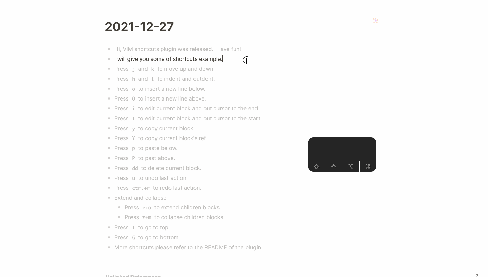

[:coffee: Get me a coffee](https://www.buymeacoffee.com/vipzhicheng) if you like this plugin!
# logseq-plugin-vim-shortcuts

This plugin provide some shortcuts which give Logseq a VIM-like feeling.

## Supported shortcuts

- `j`: Move to next line. In visual block mode, it is for selecting down.
- `k`: Move to previous line. In visual block mode, it is for selecting up.
- `h`: Highlight focus out to parent level.
- `l`: Highlight focus into child level.
- `J`: Move to next sibling. In visual block mode, it is for moving down.
- `K`: Move to previous sibling. In visual block mode, it is for moving up.
- `H`: Outdent.
- `L`: Indent.
- `a` and `A`: Move the cursor to the end and enter edit mode.
- `i` and `I`: Move the cursor to the beginning and enter edit mode.
- `yy`: Copy current block content. Only supports one block – for copying multiple blocks, please use `cmd+c`.
- `Y`: Copy current block ref.
- `p`: Paste clipboard content to next sibling. Only supports one block – for pasting multiple blocks, please use `cmd+v`.
- `P`: Paste clipboard content to previous sibling. Only supports one block – for pasting multiple blocks, please use `cmd+v`.
- `o`: Insert an empty block to next sibling.
- `O`: Insert an empty block to previous sibling.
- `dd`: Delete current block. Child blocks will also be deleted, but only current block content in the clipboard.
- `dc`: Change current block (delete content and change into edit mode). For selection the first block is changed, all the others are deleted, but only the top blocks content goes into the clipboard.
- `dj`: Delete current and next blocks. Child blocks will also be deleted, but only current block content in the clipboard.
- `dk`: Delete current and prev blocks. Child blocks will also be deleted, but only current block content in the clipboard.
- `T`: Scroll to top, because Logseq uses `gg` to go to graph view.
- `G`: Scroll to bottom.
- `u`: Undo.
- `ctrl+r`: Redo.
- `gu`: Change block content to lower case.
- `gU`: Change block content to upper case.
- `mod+shift+u`: Toggle block content between lower and upper case.
- `NUMBER`+`mod+shift+u`: Trigger different case style, supports 1–16.
- `zo`: Extend block.
- `zc`: Collapse block.
- `zO`: Extend block hierarchically.
- `zC`: Collapse block hierarchically.
- `NUMBER`+`m`: Save current page or block as a mark to `NUMBER` register.
- `NUMBER`+`'`: Load saved mark on main region.
- `NUMBER`+`mod+'`: Load saved mark on right sidebar.
- `cmd+j cmd+j`: Exit editing mode. `ctrl+[` does the same thing.
- `mod+alt+j`: Join next sibling block.
- `mod+shift+enter`: Jumping into internal page or tag.
- `mod+shift+;` and `mod+alt+;`: Trigger command mode. This provides many handy commands to use, explained below.
- `ctrl+a`: Increase the first found number in block. Supports multiple selections and combo.
- `ctrl+x`: Decrease the first found number in block. Supports multiple selections and combo.
- `x`: Cut a leading character. Supports multiple selections.
- `X`: Cut a leading word. Supports multiple selections.
- `/`: Trigger search in page bar on the below. Supports smartcase.
- `n`: Search next search match.
- `N`: Search previous search match.
- `sb`: Search block content in Baidu.
- `se`: Search block content in Wikipedia.
- `sg`: Search block content in Google.
- `sh`: Search block content in Github.
- `ss`: Search block content in Stackoverflow.
- `sy`: Search block content in Youtube.
- `ctrl+v`: Toggle visual block mode.
- `mod+/`: Trigger emoji picker UI.

## Modes

### Normal mode

A block is focused/highlighted.

### Insert mode

You can edit a block.

### Visual block mode

You can select more blocks up and down and move the selected blocks using `j` and `k`.

### Command mode

In VIM this mode can be triggered by `:`, but here, the shortcut is `mod+shift+;`, also can be memorized as `mod+:`. After trigger, you can find an input area at the bottom, you can input some commands here like in VIM. For now it's about 10+ commands, but I believe that would be more.

NOTE: on Windows, the trigger is `ctrl+alt+;`

#### The bottom input features

- Autosuggestion when you input.
- Press `Tab` if only one command matched, the matched command will be autocompleted right away.
- Press `Up` and `Down` to traverse command history, it's a 1000 limit history, I think it's enough to use.
- Press `Esc` to close command mode and back to the main window. For now Logseq can not get focused automatically sometime. so you need to click the main window to continue.
- Just in case bug stuck, there are `Run` button and `Close` at bottom right to help you trigger behaviors.

#### Supported commands

- `:NUMBER` to scroll to specific line or `:-NUMBER` to scroll to specific line to the end or `:.NUMBER` represents scrolling to NUMBER * 100% of the page.
- `:s/` and `:substitute/`: Replace current block according regex, e.g. `s/foo/bar/gi`, Notice it support Regex modifiers.
- `:%s/`a nd `:%substitute/`: Replace current page blocks according regex, e.g. `%s/foo/bar/gi`.
- `:marks`: Show marks.
- `:delm` and `:delmarks`: Delete specific mark ids, e.g. `:delm 1 2 3`.
- `:delm!` and `:delmarks!`: Delete all marks.
- `:m` and `:mark`: Go to specific mark, e.g. `:m 1`.
- `:go`: Go to existed page or block, e.g. `:go 2022-02-22` or `:go ((6219c981-256a-4464-bc62-4ecfab4c2141))`.
  - There are some shortcuts for page name:
    - `:go @` and `:go @index`: Go to Contents page
    - `:go @today` Go to today's journal page.
    - `:go @yesterday` Go to yesterday's journal page.
    - `:go @tomorrow` Go to tomorrow's journal page.
    - `:go @prev` Go to prev-day's journal page, if currect page is not a journal page, fallback to @yesterday.
    - `:go @next` Go to next-day's journal page, if currect page is not a journal page, fallback to @tomorrow.
    - `:go @back` Go to backward page.
    - `:go @forward` Go to forward page.
  - `:go!`: Go to existed page or block, create one if page not exist, e.g. `:go 2022-02-22` or `:go ((6219c981-256a-4464-bc62-4ecfab4c2141))`.
  - `:go!` and `:go` support `--ns` and `--namespace` to go or create namespace page. e.g. you run command `:go! subpage --ns` on `test` page, then you will be redirect to `test/subpage` for saving your time to input prefix chars.
- `:re` and `:rename`: Rename current page name, if target page exists, page content will be merged.
- `:undo` and `:redo`: Undo and redo last edit.
- `:lorem` and `:lorem-ipsum`: generate random blocks in same level, with `--unit word|paragraph|sentence` to change random block unit.
  - `--unit` has a short style as `-u`
  - `word`, `paragraph` and `sentence` also have short styles as `w`, `p`, and `s`.
  - also support `-p`, `-s`, `-w` and `--paragraph`, `--sentence`, `--word`.
- `:emoji`: Insert emojis by searching keyword, you can repeat emoji by appending a number.
- `:emoji-picker`: Insert emoji by emoji UI.
- `:sort` and `rsort`: Sort page first level blocks with no focus any blocks and sort sub level blocks with focus on one block.
- `:bg [namedColor|hexColor]`: Set block background color, support multiple block selection.
- `:bg-picker`: Trigger a color picker to select block background color, support multiple block selection.
- `:bg-random`: Set block background color randomly, support multiple block selection.
- `:bg-clear`: Clear block background color, support multiple block selection.
- `:copy-path`: Get page or journal absolute path, so you can edit it outside of Logseq.
- `:open-in-vscode`: Open page or journal in VSCode.
- `:w` and `:write`: Save current page, actually this is a fake one, because Logseq save automatically.
- `:wq`: Save current page and quit vim command mode.
- `:q` and `:quit`: Quit vim command mode.
- `h` and `help`: Show a help message modal.

## Case Change Styles

- `1`: Toggle upper and lower case, the default behavior.
- `2`: Change to upper case. e.g. `LOGSEQ IS SO AWESOME`
- `3`: Change to lower case. e.g. `logseq is so awesome`
- `4`: Change to title case. e.g. `Logseq Is so Awesome`
- `5`: Change to sentence case. e.g. `Logseq is so awesome`
- `6`: Change to path case. e.g. `logseq/is/so/awesome`
- `7`: Change to capital case. e.g. `Logseq Is So Awesome`
- `8`: Change to constant case. e.g. `LOGSEQ_IS_SO_AWESOME`
- `9`: Change to dot case. e.g. `logseq.is.so.awesome`
- `10`: Change to header case. e.g. `Logseq-Is-So-Awesome`
- `11`: Change to param case. e.g. `logseq-is-so-awesome`
- `12`: Change to pascal case. e.g. `LogseqIsSoAwesome`
- `13`: Change to camel case. e.g. `logseqIsSoAwesome`
- `14`: Change to snake case. e.g. `logseq_is_so_awesome`
- `15`: Change to swap case. e.g. `lOGSEQ IS SO AWESOME`
- `16`: Change to random case. e.g. `logsEQ IS SO awESoME`

## Mark feature notes

- Logseq have `Favorites` and `Recent` feature, and we also have a `Tabs` plugins, the mark feature kind of like Tabs position, but give the power to yourself to decide which is which, that feels good to me.
- Marked pages and blocks can be persisted automatically and graph separately.
- NUMBER can be more than 10, actually thousands if you wish.
- The `m` shortcut could be conflicted with `Markmap` plugin, so if you met this issue, please upgrade `Markmap` plugin to latest version.
- NUMBER=1 is the default one, so you can just press `m` to save and press `'` to load for mark 1.

## Slash commands this plugin added

Because some VIM shortcuts or commands may also need to be as a slash command, so this plugin provides some.

- `/Insert Emoji`: Insert emoji at current position.
- `/Sort Blocks`: Sort sub level children blocks from a to z.
- `/Reverse Sort Blocks`: Sort sub level children blocks from z to a.
- `/Random Bg Color`: Set block background color
- `/Children Random Bg Color`: Set children blocks background color

## Named Background Colors

The named colors you can use in `:bg` command are from [here](https://developer.mozilla.org/en-US/docs/Web/CSS/color_value)

## Search in page

Like in VIM, if you press `/` you can trigger in-page search, and it support smartcase which means if you search in lower case it will match case insensitive and if you search a keyword including upper case char then it will match case sensitive.

## Other notes

- Logseq keybindings support may be changed in future, so just use it for a while if you need it, and it may be conflicted with Logseq future shortcuts.
- Not exactly same with VIM key-bindings, just mimic.
- If you are on journal home page, some shortcuts will redirect you to specific page, because there is no API can stay journal home page and move block highlight line.
- Some shortcuts are not perfect for now, maybe need more polish and some support from Logseq Team.
- There may be more shortcuts coming soon.
- Stay tuned.
- Copy here not means copy to system clipboard, just in memory of Logseq.
- The `VIM` scroll to top shortcut is `gg`, if you want it, you can change Logseq gg shortcut to another one, and set gg in plugin settings JSON file.
- Some shortcuts support VIM-like combo actions, that means pressing `N+action` to run action `N` times.
- The join shortcuts can only join siblings without children blocks and should not be trigger too fast in editing mode.
- Jumping internal page support combo action to select which page to jump.
- All actions support multiple key bindings in settings JSON file.
- `mod` means `Cmd` on Mac, `Ctrl` on Windows/Linux.
- Recommend version of Logseq is `v0.5.9`+.

## ❤️ Buy me a coffee

If this plugin solve your situation a little bit and you will, you can choose to buy me a coffee via [this](https://www.buymeacoffee.com/vipzhicheng) and [this](https://afdian.net/@vipzhicheng), that means a lot to me.

## Licence

MIT
